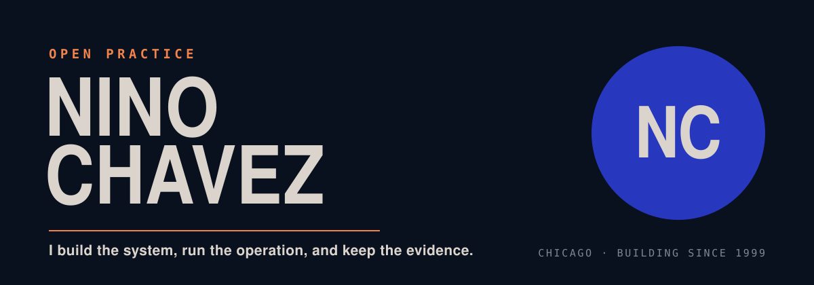
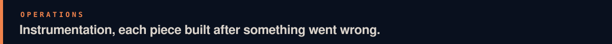

<p align="center">
  
</p>

I design products, build the software behind them, and run them in the real world.

Agents are how the work gets done — not a layer bolted on top. Spec, code, docs and
agents are one substrate. The tools below are the ones that survived daily use.

**[Work](https://ninochavez.co/work)** · products, tools, methods and operations, by domain
&nbsp;&nbsp;**[Sessions](https://ninochavez.co/demos)** · complete agent sessions, failures left in
&nbsp;&nbsp;**[Learn](https://ninochavez.co/learn)** · self-directed routes through the work
&nbsp;&nbsp;**[Writing](https://ninochavez.co/blog)** · Signal Dispatch


**[blueprint](https://github.com/nino-chavez/blueprint)** — run a product initiative end to
end with an agent: research, prototype, strategy docs, fact-check, deploy.

```bash
npx @nino-chavez-labs/blueprint-cli init --name=my-initiative
```

**[browse-tool](https://github.com/nino-chavez/browse-tool)** — drive a real Chrome from
bash. Ten commands and a README, instead of the 13–18k tokens of schema an equivalent MCP
loads up front.

```bash
git clone https://github.com/nino-chavez/browse-tool.git && cd browse-tool && npm install
```

**[agentic-ways-of-working](https://github.com/nino-chavez/agentic-ways-of-working)** — one
canonical principles doc, adapters per tool, and the hooks that keep the rules enforced
after the session ends.

```bash
git clone https://github.com/nino-chavez/agentic-ways-of-working.git
cd agentic-ways-of-working && ./install.sh
```

**[claude-recall-cli](https://github.com/nino-chavez/claude-recall-cli)** — save and search
reusable session recipes. SQLite + FTS5 behind global slash commands.

```bash
git clone https://github.com/nino-chavez/claude-recall-cli.git ~/.claude/recall-cli \
  && bash ~/.claude/recall-cli/install.sh
```

**[ai-champions-kit](https://github.com/nino-chavez/ai-champions-kit)** — skills and
subagents for the person driving AI adoption inside a company.

```bash
git clone https://github.com/nino-chavez/ai-champions-kit.git
./ai-champions-kit/install.sh --tier universal
```


No audio or screen capture goes anywhere. Apple Silicon.

- **[local-dictation](https://github.com/nino-chavez/local-dictation)** — tap a hotkey,
  speak, tap again. Cleaned-up text lands in whatever field has focus. Say "take a note"
  first and it goes to Notes instead, without stealing focus.
- **[meeting-notes-local](https://github.com/nino-chavez/meeting-notes-local)** — a
  notetaker that captures the call from your own machine. No bot joins the meeting.
- **[cortex](https://github.com/nino-chavez/cortex)** — continuous screen and audio capture
  with on-device search and chat.



- **[repo-health-check](https://github.com/nino-chavez/repo-health-check)** — audits repo
  settings for drift `grep` can't see. Written after finding 347 dead deployment records and
  stale About links across eight repos.
- **[gha-minutes](https://github.com/nino-chavez/gha-minutes)** — diagnose Actions minute
  burn and apply the mechanical fix. Portable extract of a pass that cut ~2,900 billed
  minutes roughly in half.
- **[worktree-orchestrator](https://github.com/nino-chavez/worktree-orchestrator)** —
  coordinate parallel agents across git worktrees so they stop switching branches under each
  other.
- **[claude-orchestrator](https://github.com/nino-chavez/claude-orchestrator)** — async task
  queue for the Claude API, with rate-limit backoff.


- **[Ways of working](https://ninochavez.co/demos)** — complete agent sessions published as
  teaching demos: what happened, what failed, what changed, and which techniques held up.
- **[work-library-pattern](https://github.com/nino-chavez/work-library-pattern)** — a reading
  portal that holds no documents. Every page comes from another repository, pinned to an
  exact commit; merging a pull request is what publishes.
- **[specchain](https://github.com/nino-chavez/specchain)** — spec-driven workflow: idea →
  spec → tasks → implementation, with deterministic gates between agentic stages.
- **[concepts](https://github.com/nino-chavez/concepts)** — the ideas behind work that has no
  public repo yet.


- **[Rally HQ](https://rallyhq.app)** — tournament management. Registration, brackets,
  schedules, and live scoring on one public event page. Open beta.
- **[aisles](https://github.com/nino-chavez/aisles)** — AI-native headless storefront on
  BigCommerce, persona-adaptive layouts.
- **[Flickday Media](https://flickdaymedia.com)** — grassroots sports media out of Chicago.

---

[ninochavez.co](https://ninochavez.co) · [Signal Dispatch](https://ninochavez.co/blog) ·
[Photography](https://ninochavez.co/photography)
